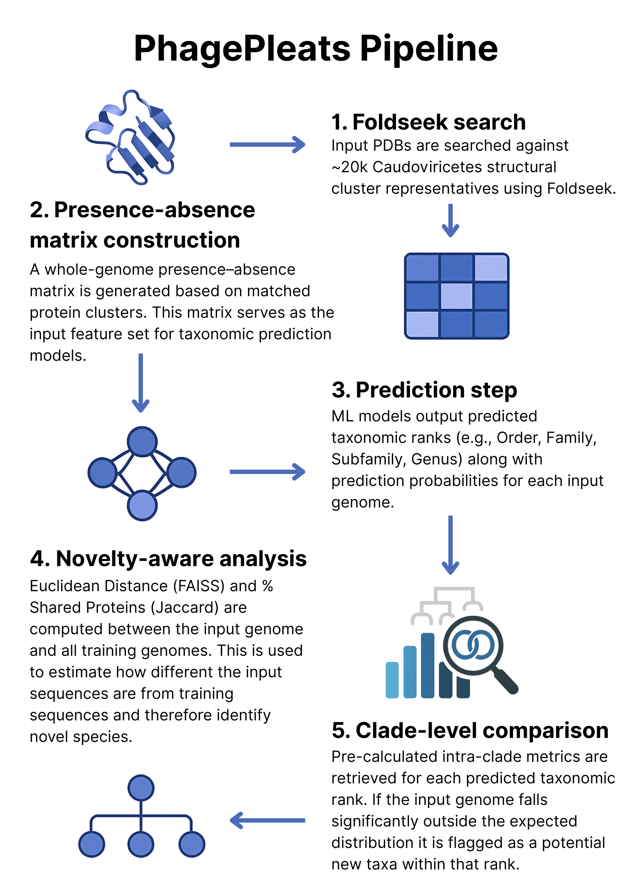

<p align="center">
  
</p>

# PhagePleats

**PhagePleats** is a tool for taxonomically classifying dsDNA bacteriophages of the order Caudoviricetes.

Each fold, a secret,<br>
A tapestry starts to form —<br>
PhagePleats dares to know. 🦠🧬🐍

## Features

- 🔬 Predict taxonomic ranks (Order, Family, Subfamily, Genus) of your phage
- 🧬 Compute % shared proteins and distance between input phage genomes and established taxonomic ranks

<p align="center">
  
</p>

## 📦 Installation

Clone the repository and set up the environment:

```bash
git clone https://github.com/linda5mith/PhagePleats.git
cd PhagePleats
conda env create -f environment.yml
conda activate phagepleats
```

## ▶️ Running PhagePleats

Edit the `config.yml` file to include paths to your:

- `pdbs/` directory  
- genome-to-protein mapping file  
- desired output directory  

> **Note:** The default `config.yml` is already set up to run on the included test data.

Then run the pipeline:

```bash
snakemake --cores 4
```

📊 Interpreting PhagePleats Outputs

PhagePleats outputs three main result files:
🧬 taxonomy_predictions.csv

This file contains the predicted taxonomy for each input phage, along with confidence scores for each taxonomic rank.

Columns:

    Genome — Identifier of the query phage genome

    Order, Family, Subfamily, Genus — Predicted taxonomic assignments

    *_prob — Confidence score (probability from 0 to 1) for each prediction

🧬 phage_closest_hit.csv

This file shows the closest training genome (in protein space) for each input genome.

Columns:

    input_genome — Query genome name

    closest_training_genome — Closest reference genome from the training set

    euclidean_distance — Distance to closest training genome hit

    %_shared_proteins — Jaccard similarity with the closest genome

    Order, Family, Subfamily, Genus — Known taxonomy of the closest genome

🧬 novel_taxa_summary.csv

This is the novelty-aware output, combining taxonomic predictions, clade similarity metrics, and novelty flags.

Columns:

    Genome — Input genome name

    closest_training_genome — Closest reference match

    euclidean_dist_to_closest_hit — Distance to that closest match

    %_shared_with_predicted_* — Avg. % shared proteins with the predicted clade

    eucl_dist_to_predicted_* — Avg. Euclidean distance to the predicted clade

    *_z_shared_proteins, *_z_euclidean_distance — Z-scores compared to intra-clade distribution

    *_novelty_flag — Novelty classification, one of:

        Likely member

        Potential new genus, Potential new family, etc.

        Unknown (e.g. if clade stats are missing)

🧪 Use this file to assess whether your input phages may represent novel taxa.