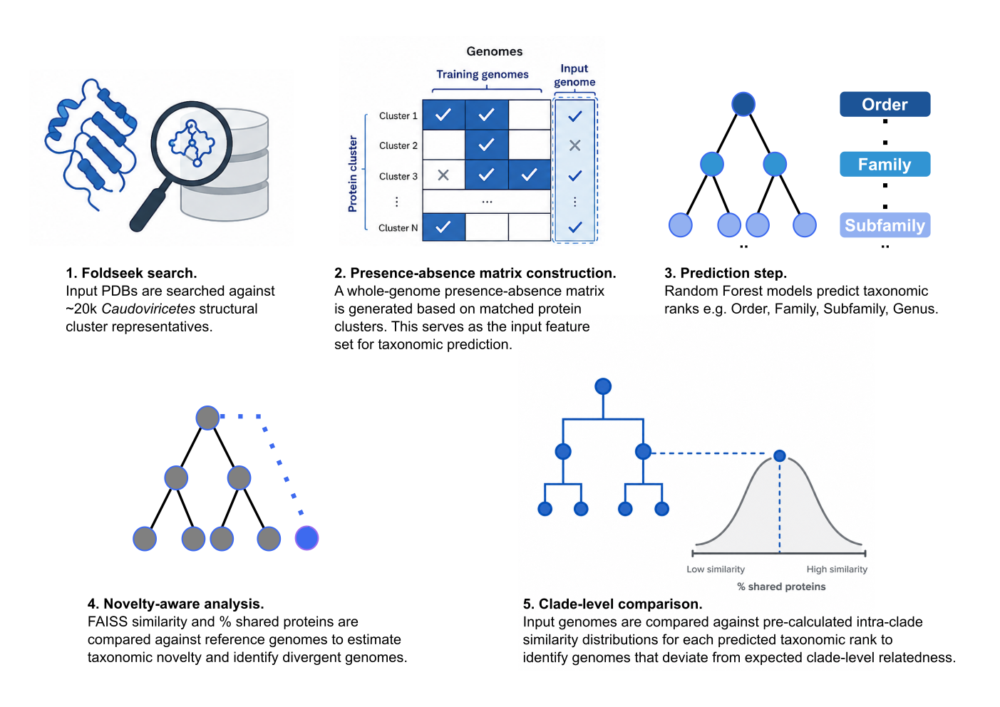
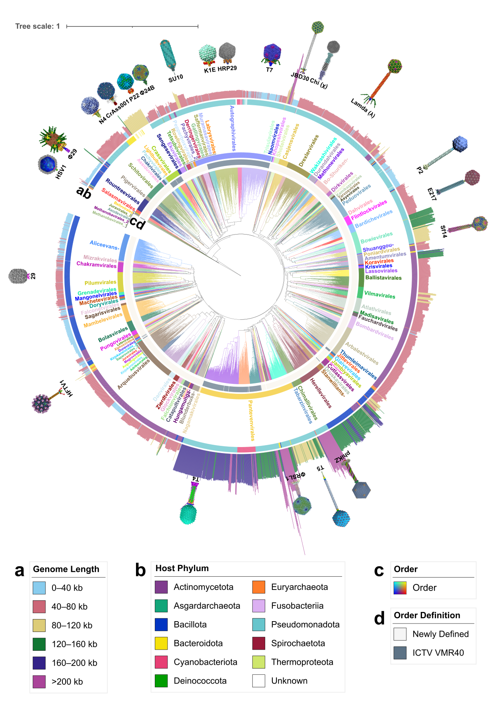

<p align="center">
  
</p>

# PhagePleats

**PhagePleats** is a command-line tool for taxonomic classification of dsDNA bacteriophages (*Caudoviricetes*) using structural protein profiles.

The framework underlying PhagePleats was developed from the large-scale structural analysis described in *A novel approach to Caudoviricetes taxonomy utilising whole proteome structure-structure comparison*.

This reference taxonomy was generated from:
- 4,082 reference *Caudoviricetes* genomes (ICTV)
- 445,151 predicted protein structures (ESMFold)
- Large-scale structural clustering and phylogenetic analysis 
- RED-based clade normalization
- Yielding a revised structural taxonomy comprising 159 orders, 267 families, 502 subfamilies, and 1,189 genera across *Caudoviricetes*.

<p align="center">
  
</p>

<p align="center">
  
</p>

Structures speak in code,<br>
Viral stories fold and flow -<br>
PhagePleats dares to know. 🦠🧬

---

## 📦 Installation (recommended: mamba)

PhagePleats is distributed as an **installable CLI tool** via a conda environment  
(required for FAISS and Foldseek compatibility).

### 1. Clone the repository

```bash
git clone https://github.com/linda5mith/PhagePleats.git
cd PhagePleats
```

### 2. Create & activate the environment
```bash
mamba env create -f environment.yml
mamba activate phagepleats
```

## ▶️ Running PhagePleats
```bash
phagepleats run \
  --path_to_pdbs /path/to/pdbs \
  --protein_genome_map /path/to/genome_protein_mapping.csv \
  --outdir /path/to/output_directory \
  --cores 4
```

Test pdbs and metadata found in: test_data/metadata, test_data/pdbs

| Argument         | Description                                   |
| ---------------- | --------------------------------------------- |
| `--path_to_pdbs` | Directory containing folded protein PDB files |
| `--protein_genome_map`     | CSV mapping each protein identifier to its parent genome. |
| `--outdir`       | Output directory                              |
| `--cores`        | Number of CPU cores (default: 8)              |

Example (`protein_to_genome.csv`):
```csv
protein,genome
UVX36416.1,Moriyavirus dochi
UVX36417.1,Moriyavirus dochi
UVX36418.1,Moriyavirus dochi
```

Test run (included example data)
```bash
phagepleats run \
  --path_to_pdbs test_data/pdbs \
  --protein_genome_map test_data/metadata/genome_protein_mapping.csv \
  --outdir /tmp/phagepleats_test \
  --cores 1
```

## 📊 Outputs
| Output file                             | Description                                                                                                                                                                                                                                                                                                                                            |
| --------------------------------------- | ------------------------------------------------------------------------------------------------------------------------------------------------------------------------------------------------------------------------------------------------------------------------------------------------------------------------------------------------------ |
| **taxa_predictions.csv**                | Predicted taxonomy for each input genome at the **Order**, **Family**, **Subfamily**, and **Genus** ranks, together with the classification confidence (probability) for each prediction.                                                                                                                                                              |
| **taxa_novelty_summary.csv**            | Summary of taxonomic novelty for each input genome. Reports the closest reference genome in the PhagePleats database, the proportion of shared structural proteins with the predicted taxonomic ranks, Z-scores relative to known taxa, and novelty flags indicating whether the genome is likely to represent an existing or potentially novel clade. |
| **genome_similarity_with_taxonomy.csv** | Genome-level summary of structural similarity between each query genome and reference genomes. Includes the number of shared structural proteins, alignment statistics, structural proteome coverage, and the taxonomy of each matched reference genome.                                                                                               |
| **foldseek_target_hits.csv**            | Protein-level structural homology results. Lists every query protein together with its best structural match in the reference database, including alignment statistics, predicted protein function (PFAM annotation), and the reference genome from which the matched protein originated.                                                              |
| **rank_probabilities/**                 | Directory containing the complete probability distributions produced by the machine learning classifiers for each taxonomic rank. Useful for inspecting alternative classifications and borderline predictions.                                                                                                                                        |
| **log/**                                | Log files generated during the PhagePleats workflow, including Foldseek and pipeline execution logs for troubleshooting and reproducibility.                                                                                                                                                                                                           |


### 📚 Citation

If you use PhagePleats in your work, please cite:

*A novel approach to Caudoviricetes taxonomy utilising whole proteome structure-structure comparison*